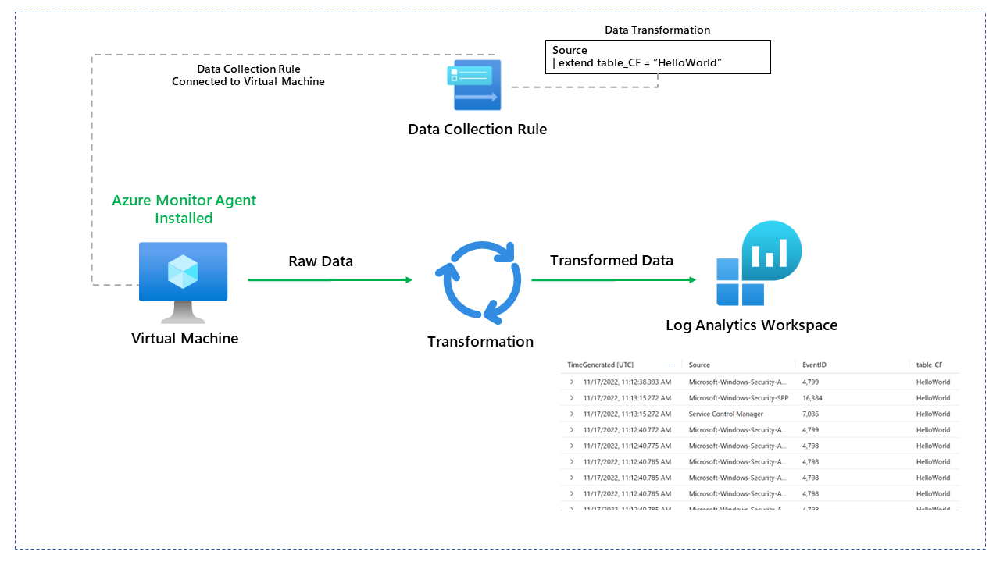
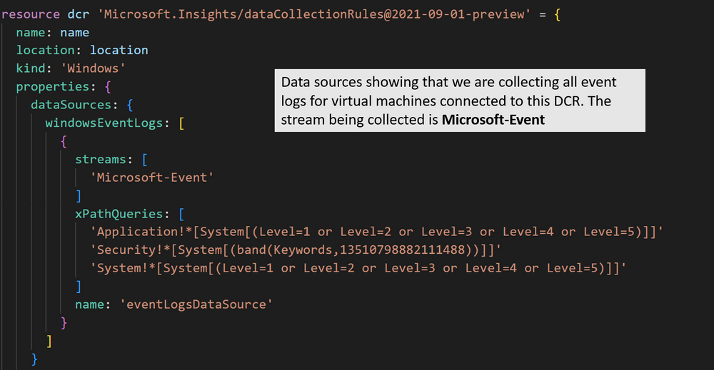
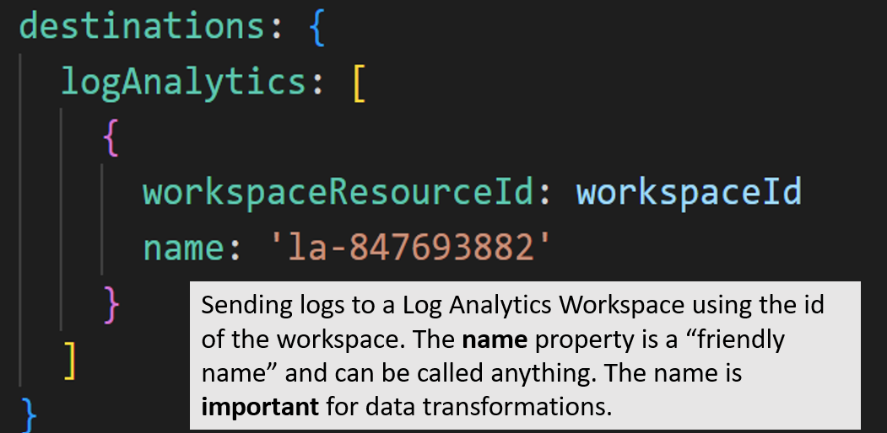
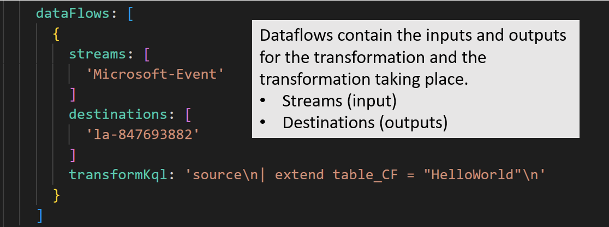
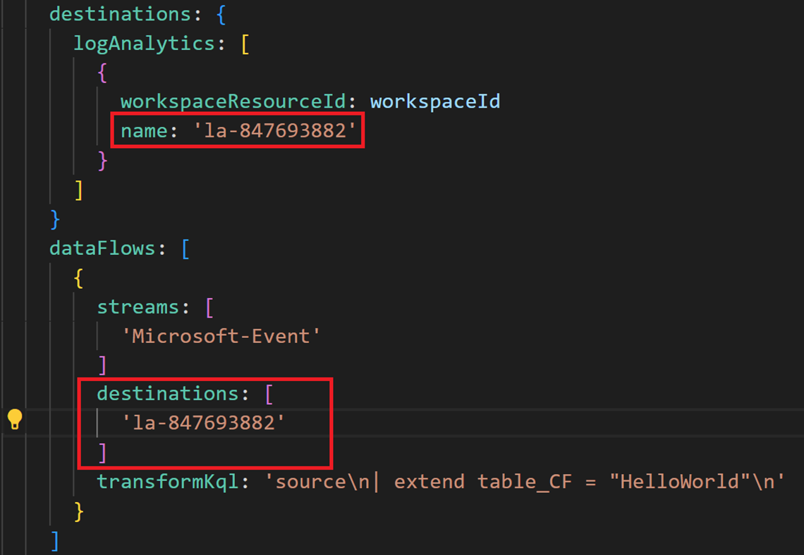
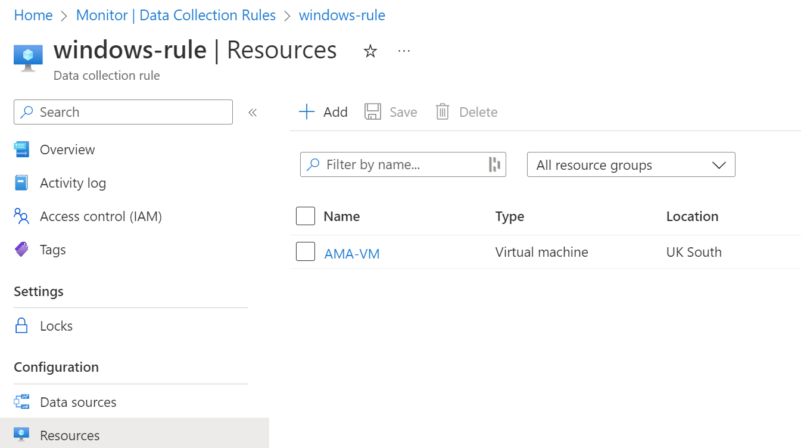
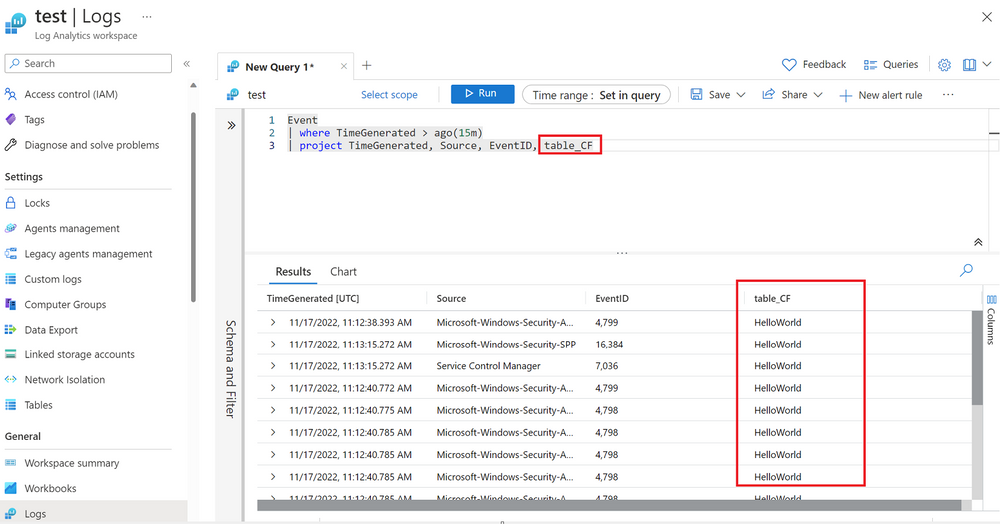

As the title suggests in this blog post, we will look at the Data Collection Transformations you can do with Data Collection Rules (DCR) and why they may benefit you. 

Transformations allow you to filter or modify incoming data before it's sent to a Log Analytics workspace. There are several reasons why you might want to do this. 

- Reduce costs by filtering unwanted data being ingested into the workspace. 
- Remove sensitive values being ingested through logs.
- Enrich data that may benefit the organisation. 

This post will look at data transformation rules using the Azure Monitor Agent on virtual machines. Transformations are also possible for data ingested into a workspace that doesn't require an agent (Think about diagnostic logs for Azure resources, etc.).

So how does this work? 

A data collection rule collects data from a virtual machine using the Azure Monitor agent (AMA). The data collection rule specifies what data should be collected from the operating system. In our example, we will collect event logs from the virtual machine. 

Data collection rules also include any transformations of the data we want to perform. However, **This currently is not visible through the Azure Portal. Deployments of data collection rules that include transformations should be done through ARM or Bicep. **

A bicep file which deploys a data collection rule for Windows virtual machines is available on GitHub by visiting this link: [georgeollis/AMA_Data_Transformations (github.com)](https://github.com/georgeollis/AMA_Data_Transformations/tree/main)

Let's break down the deployment so we understand what is happening. 

 

The destinations block specifies that we send event logs to a log analytics workspace. Our example shows that logs are being sent to the log analytics workspace using its resource id.  The **name **property is a friendly name and can be called anything. The name is **important **for data transformations.

The dataflows block contains the inputs, outputs and transformations that will be complete. Our example takes logs coming in from the Microsoft-Event stream, completes the KQL transformation and sends it across to the destination.

Our example KQL adds an extra column called table_CF, and the value is "HelloWorld".  All custom fields being added through the transformation require the _CF added at the end of the column name.

As mentioned earlier, it's essential that the dataflows are aware of the destinations it's sending the transformed data. It does this using the name within the destinations block.

Once we have deployed the data collection rule, you need to add a virtual machine to pick up the data collection configuration. 

Once a virtual machine has been connected to the DCR, you will need to wait for the data to be ingested so that our new column appears. After some time, we can now see our new table_CF column appear in our Event table. 

If this content was helpful, please feel free to connect with me on social media at

- [https://bio.link/georgeollis](https://bio.link/georgeollis)
